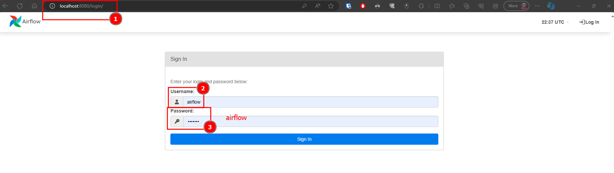
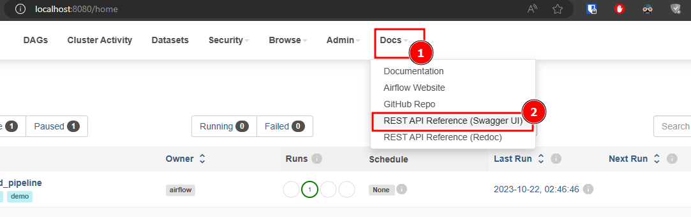

---
tags:
  - Airflow
  - Docker
icon: material/download
---

# Running Airflow in Docker

In this section, we'll guide you through the process of running Apache Airflow using Docker and Docker Compose. Docker simplifies the deployment and management of Airflow by containerizing its components, making it easier to set up and maintain. Follow these steps to get started.

## Instruction


???+ note
    The following steps are from the official docs [Running Airflow in Docker](https://airflow.apache.org/docs/apache-airflow/stable/howto/docker-compose/index.html#running-airflow-in-docker). Refer to this resource for detailed instructions and configurations

### Step 1: Fetching `docker-compose.yaml`

To deploy Airflow on Docker Compose, you should fetch the `docker-compose.yaml` configuration file. This file defines the services and their configurations required to run Airflow in containers. You can obtain this file from the official Airflow repository on GitHub or create a custom one tailored to your needs.


The official Airflow project provides a `docker-compose.yaml` file that you can use as a starting point. This configuration includes the Airflow web server, scheduler, worker, and database services. You can fetch it using `curl` or download it from the Airflow GitHub repository:

```shell
curl -LfO 'https://raw.githubusercontent.com/apache/airflow/main/docker-compose.yaml'
```

This file contains several service definitions:

- `airflow-scheduler`: The scheduler monitors all tasks and DAGs, then triggers the task instances once their dependencies are complete.

- `airflow-webserver`: The webserver is available at http://localhost:8080.

- `airflow-worker`: The worker that executes the tasks given by the scheduler.

- `airflow-triggerer`: The triggerer runs an event loop for deferrable tasks.

- `airflow-init`: The initialization service.

- `postgres`: The database.

- `redis`: The Redis broker that forwards messages from the scheduler to the worker.


Some directories in the container are mounted, which means that their contents are synchronized between your computer and the container.

- `./dags`: You can place your DAG files in this directory.

- `./logs`: This directory contains logs generated from task execution and scheduler activities.

- `./config`: Use this directory to store custom log parsers or configuration files like `airflow_local_settings.py` to configure cluster policies.

- `./plugins`: You can store your custom Airflow plugins in this directory.

### Step 2: Initializing Environment

Before starting Airflow for the first time, you need to prepare your environment, i.e. create the necessary files, directories and initialize the database.

**1. Setting the Right Airflow User**

On Linux, the quick-start needs to know your host user id and needs to have group id set to 0. Otherwise the files created in dags, logs and plugins will be created with root user ownership. You have to make sure to configure them for the docker-compose:

```bash
# Create a directory for Airflow and navigate into it
mkdir airflow
cd airflow

# Create essential directories for Airflow
mkdir -p ./dags ./logs ./plugins ./config
# Navigate back to the previous directory
cd ..

# Create a .env file with the AIRFLOW_UID variable to store your host user ID
# This step ensures that files created in dags, logs, and plugins have the correct ownership
echo -e "AIRFLOW_UID=$(id -u)" > .env
```

**2. Update the Environment File**

In the .env file, you'll add the AIRFLOW_PROJ_DIR variable, specifying the path to the Airflow project directory. This variable helps Airflow locate essential directories.

```plaintext title=".env"
# Set the Airflow user's user ID
AIRFLOW_UID=

# Define the path to the Airflow project directory
AIRFLOW_PROJ_DIR=./airflow
```
**3. Update the docker-compose File**

open your docker-compose.yaml file and locate the appropriate sections where these parameters are defined. Update them as mentioned below

```plainttext
AIRFLOW__CORE__LOAD_EXAMPLES: 'false' # Chnaged to false
AIRFLOW__CORE__ENABLE_XCOM_PICKLING: 'true' # Add this parameter
```

Following these steps ensures that your Airflow environment is set up correctly and ready for use with Docker Compose.


### Step 3: Running Airflow

Now you can start all services:

```bash
docker compose up
```

In a second terminal you can check the condition of the containers and make sure that no containers are in an unhealthy condition:

```bash
$ docker ps
CONTAINER ID   IMAGE                  COMMAND                  CREATED          STATUS                    PORTS                              NAMES
247ebe6cf87a   apache/airflow:2.7.2   "/usr/bin/dumb-init …"   3 minutes ago    Up 3 minutes (healthy)    8080/tcp                           compose_airflow-worker_1
ed9b09fc84b1   apache/airflow:2.7.2   "/usr/bin/dumb-init …"   3 minutes ago    Up 3 minutes (healthy)    8080/tcp                           compose_airflow-scheduler_1
7cb1fb603a98   apache/airflow:2.7.2   "/usr/bin/dumb-init …"   3 minutes ago    Up 3 minutes (healthy)    0.0.0.0:8080->8080/tcp             compose_airflow-webserver_1
74f3bbe506eb   postgres:13            "docker-entrypoint.s…"   18 minutes ago   Up 17 minutes (healthy)   5432/tcp                           compose_postgres_1
0bd6576d23cb   redis:latest           "docker-entrypoint.s…"   10 hours ago     Up 17 minutes (healthy)   0.0.0.0:6379->6379/tcp             compose_redis_1
```

### Step 4: Accessing the environment

After starting Airflow, you can interact with it in 3 ways:

**1. Accessing the web interface**
Once the cluster has started up, you can log in to the web interface and begin experimenting with DAGs.

The webserver is available at: `http://localhost:8080`. The default account has the login `airflow` and the password `airflow`



**2. Sending requests to the REST API**

Basic username password authentication is currently supported for the REST API, which means you can use common tools to send requests to the API.



### Step 5: Cleaning up

To stop and delete containers, delete volumes with database data and download images, run:

```bash
docker compose down
```

## Conclusion

In this tutorial, you've gained a foundational understanding of Apache Airflow and how to set it up with Docker and Docker Compose. With key concepts, terminology, and initial configurations covered, you're now well-prepared to start orchestrating and automating workflows using Airflow. As you explore the possibilities, remember that this tutorial is just the beginning. The Airflow ecosystem offers extensive capabilities and customization options for more advanced use cases. For further learning and troubleshooting, the Airflow community and official documentation are valuable resources. Your Airflow journey has just begun – happy orchestrating!
