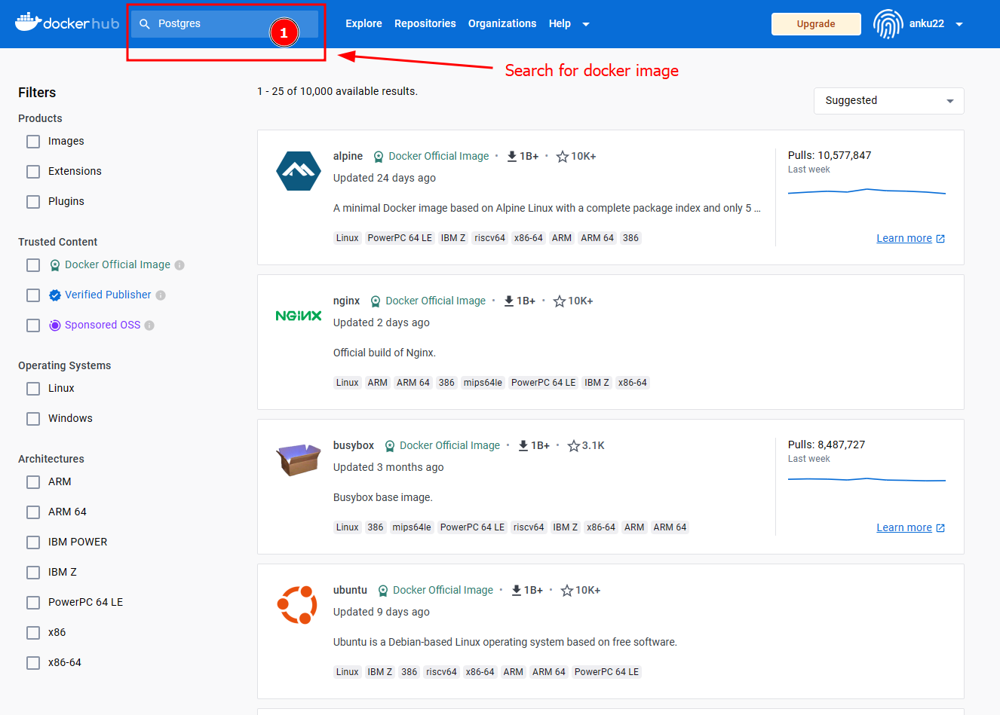
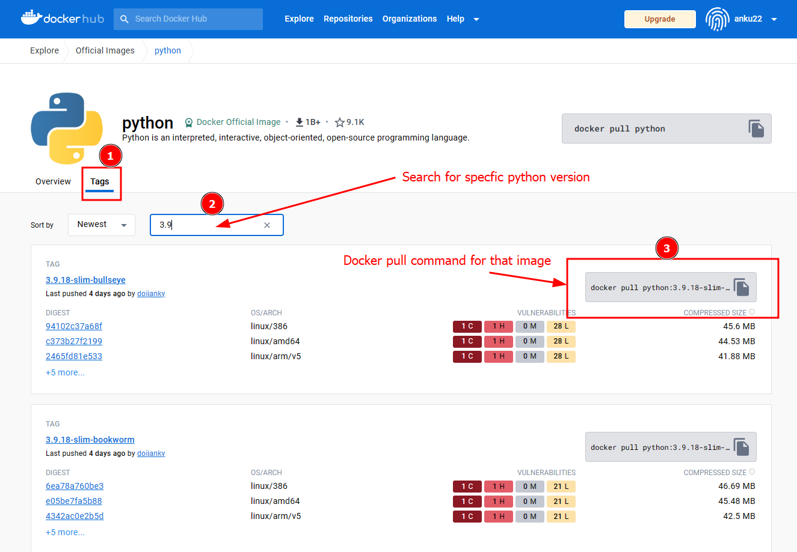

---
tags:
  - Containers
  - Docker
icon: octicons/container-16
---
# Containers

## Introduction

Containers have revolutionized the way we deploy and manage applications. In this document, we will explore the concept of containers, their advantages, and how they are transforming the world of software development and deployment.

## What are Containers

Containers are lightweight, portable, and self-sufficient units that encapsulate an application and its dependencies. They provide a consistent environment for running applications across different platforms. Unlike traditional virtualization, containers share the host operating system's kernel, making them highly efficient and easy to manage.

## Characteristics of Containers

Containers exhibit the following key characteristics:

- **Isolation**: Containers isolate applications from one another and from the host system, ensuring that each application runs in its own environment without interference.

- **Portability**: Container images are portable, allowing you to run the same application on any system that supports the container runtime.

- **Efficiency**: Containers are lightweight and efficient, as they share the host operating system's kernel and resources.

- **Versioning**: Container images can be versioned, making it easy to roll back to a previous version or upgrade to a newer one.

- **Easy Deployment**: Containers simplify the deployment process, enabling rapid application deployment and scaling.

## Docker vs Virtual Machines


## Key Terminology in Docker

Before we dive deeper into the world of Docker, it's essential to understand some key terminology that forms the foundation of container technology.

### 1. Image

In Docker, an image is a lightweight, standalone, and executable package that contains everything needed to run an application, including the code, a runtime, libraries, environment variables, and configuration files. Images serve as the blueprint for containers. They are read-only and can be shared and distributed via container registries, making it easy to move applications between different environments.

You can find a vast collection of pre-built Docker images on [Docker Hub](https://hub.docker.com/), which is a public container registry. Docker Hub allows you to search for, pull, and use images shared by the Docker community and other organizations. These images can save you time and effort by providing a starting point for your own Docker containers.



Docker images are often based on a base image and can be customized to include specific software and configurations.

Examples:

- **Python** :  [Docker Official Python Image](https://hub.docker.com/_/python)

    Python is an interpreted, interactive, object-oriented, open-source programming language.

- **Postgres** :  [Docker Official Postgres Image](https://hub.docker.com/_/postgres)

    The PostgreSQL object-relational database system provides reliability and data integrity.

In Docker, tags play a crucial role in versioning and managing Docker images. A tag is a label or identifier that is associated with a specific version of an image. Tags allow you to distinguish between different versions of an image and provide a way to reference and use a particular image.



### 2. Container

A container is an instance of a Docker image. It's a runnable process that includes not only the application code but also the necessary libraries and runtime environment. Containers are isolated from one another and from the host system, which ensures consistent and reliable application execution. Containers can be created, started, stopped, moved, and deleted, making them highly dynamic and versatile for deploying applications.

### 3. Dockerfile

A Dockerfile is a text document that contains a set of instructions for building a Docker image. These instructions specify the base image, add files, install software, configure environment variables, and define the command to run when the container starts. Dockerfiles provide a way to automate the creation of container images, ensuring consistency and reproducibility. By following the instructions in a Dockerfile, you can build an image that precisely matches your application's requirements.

```Dockerfile title="Dockerfile"
# Use an official Python runtime as a parent image
FROM python:3.8

# Set the working directory in the container
WORKDIR /app

# Copy the current directory contents into the container at /app
COPY . /app

# Install any needed packages specified in requirements.txt
RUN pip install --trusted-host pypi.python.org -r requirements.txt

# Make port 80 available to the world outside this container
EXPOSE 80

# Define environment variable
ENV NAME World

# Run app.py when the container launches
CMD ["python", "app.py"]

```

### 4. Docker Compose

Docker Compose is a tool for defining and running multi-container Docker applications. It uses a YAML file to configure application services, networks, and volumes. Docker Compose simplifies the process of managing complex applications with multiple containers and their interactions. It's especially useful for orchestrating microservices-based architectures.

```yaml title="docker-compose.yml"
version: '3'
services:
  web:
    image: python:3.8
    container_name: my-python-app
    command: python app.py
    ports:
      - "80:80"
```

## Conclusion

Understanding these key terms is crucial for working effectively with Docker. Images provide the building blocks for containers, Dockerfiles define how images are created, and containers are the running instances of those images. Docker Compose further extends Docker's capabilities to manage complex applications and their components.
