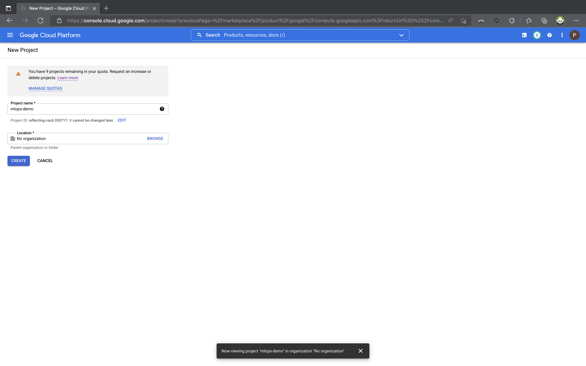
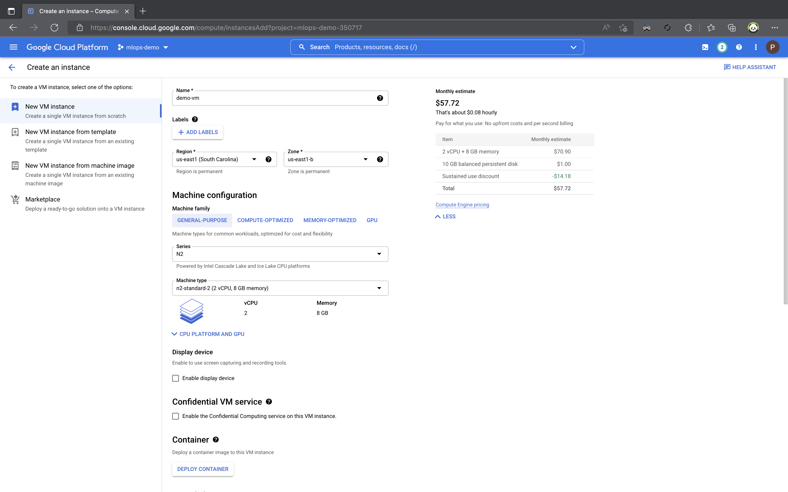
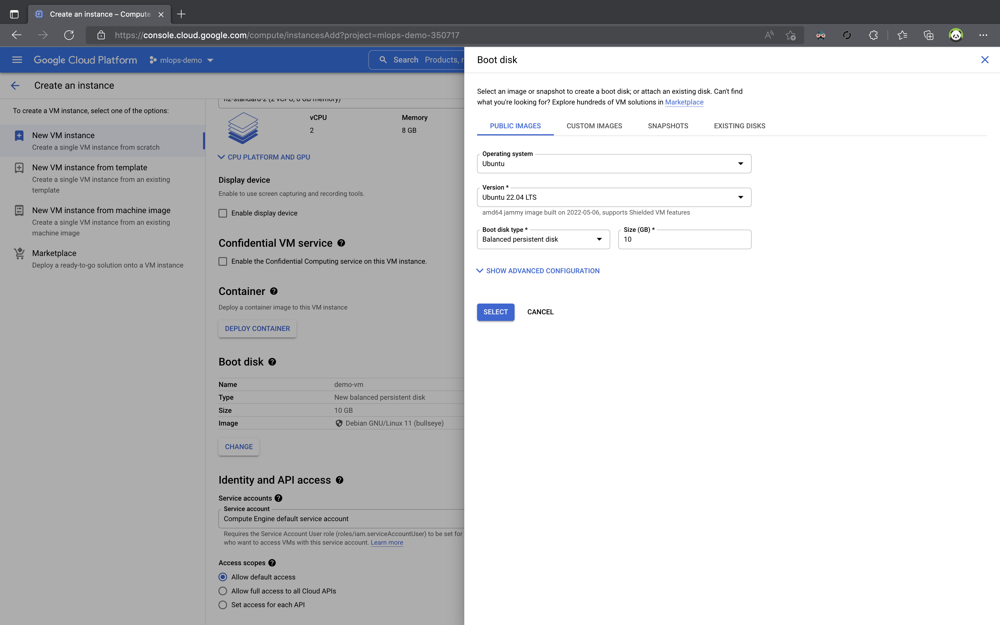
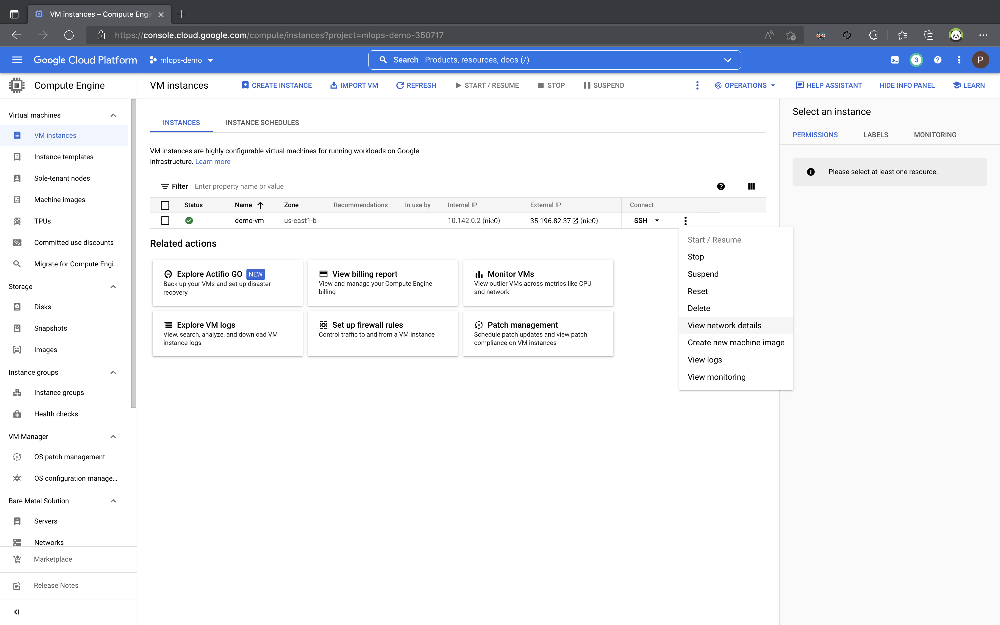
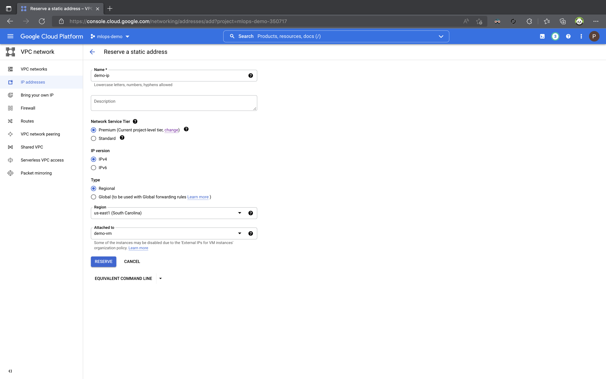
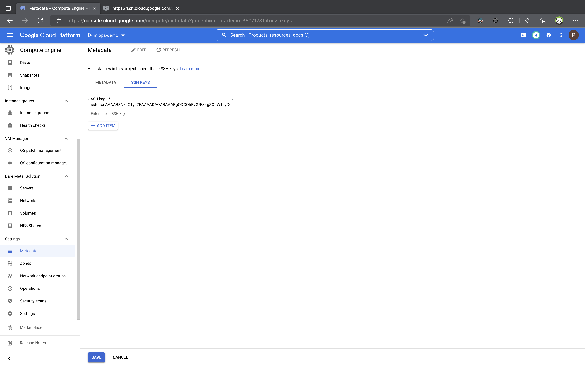

---
tags:
  - GCP
  - Compute Engine
# hide:
#   - navigation
#   - toc

---

# Provisioning a Compute Engine on Google Cloud Platform (GCP) and Connecting to VS Code
## Infrastructure Setup


Welcome to the guide on setting up your infrastructure on Google Cloud Platform (GCP) and connecting to Visual Studio Code (VS Code). This step-by-step guide will help you get started with GCP services.

### Step 1: Log into the GCP Console and Create a Project

1. Open your web browser and go to the [Google Cloud Console](https://console.cloud.google.com/).
2. Sign in with your Google account credentials.
3. After signing in, you'll be taken to the GCP dashboard. Click on the project dropdown menu at the top of the screen and select "New Project."

4. In the "New Project" window, provide a name for your project. Let's name it `mlops-demo`.

5. Click the "Create" button to create the project.

   

### Step 2: Create a Compute Engine Instance

Now that you have your GCP project set up, let's create a virtual machine instance using Compute Engine.

1. In the GCP Console, ensure that you've selected the `mlops-demo` project in the project dropdown.

2. In the left-hand navigation pane, scroll down and select "Compute Engine" under "Compute."

3. Click the "Create" button to create a new virtual machine instance.

4. In the "Create an instance" form, fill in the following configuration details:

    - **Name:** Enter a name for your VM, e.g., `demo-vm`.

    - **Region:** Select a region where you want to deploy the VM. For example, you can choose `us-east1`.

    - **Zone:** Choose a zone within the selected region, for instance, `us-east1-b`.

    - **Series:** Select a series, such as `N2`.

    - **Machine Type:** Choose an appropriate machine type, like `n2-standard-2`.

    - **Boot Disk:**
        - **Image:** Select "Ubuntu 22.04 LTS" as the operating system image.

    - **Firewall:** Check both options to allow incoming traffic:
        - "Allow HTTP traffic"
        - "Allow HTTPS traffic"

5. Review the configuration settings to ensure they match the above recommendations.

6. Click the "Create" button to provision the VM. This process may take a few moments, so be patient.





### Step 3: Assign a Static Public IP Address

To ensure that your Google Cloud Compute Engine instance has a consistent and publicly accessible IP address, you can reserve a static IP address. This step is especially useful when you need to connect to your instance using remote tools like Visual Studio Code. Here's how to assign a static public IP:

1. **Access Network Details:**
    - In the Google Cloud Console, navigate to the "Compute Engine" section by clicking on the left-hand menu.
    - Under the "VM instances" category, select the virtual machine (VM) instance for which you want to assign a static IP address. If you haven't created an instance yet, you can refer to the previous steps for instructions on how to create one.

2. **View IP Addresses:**
    - Within the selected VM instance's details page, click on the "Edit" button to make changes to the instance's configuration.

3. **Reserve a Static Address:**
    - In the "Edit VM instance" page, scroll down to the "Network interfaces" section.
    - Locate the "External IP" dropdown menu, and click on it to reveal the available options.
    - Select "Create IP address."

4. **Configure the Static IP Address:**
    - In the "Create an IP address" dialog, you can specify a name for your static IP address.
    - Leave the "IP version" set to IPv4 unless you have specific requirements for IPv6.
    - You can also define the "Region" where you want to create the IP address. It's a good practice to choose a region that aligns with the region of your VM instance, although it's not a strict requirement.

5. **Create the Static IP Address:**
    - Click the "Reserve" button to create the static IP address. Once you click this, the IP address becomes reserved and associated with your project.





You have successfully assigned a static public IP address to your Compute Engine instance, making it easier to consistently access your virtual machine, whether for SSH connections or remote development using Visual Studio Code. This static IP address remains associated with your VM instance until you release it manually or make changes to the instance's configuration.

### Step 4: Enabling SSH for Google Compute Engine

In this step, we will generate an SSH key and configure it for use with Google Compute Engine (GCE). SSH (Secure Shell) keys allow you to securely access your virtual machine instances on Google Cloud Platform (GCP). Follow these instructions to enable SSH access.

1. **Generate an SSH Key**

    For Mac OS and Linux users, open your terminal. If you are using Windows, you may need to adapt the commands accordingly.

    Execute the following command to generate an SSH key pair. This command creates a new SSH key with the RSA encryption algorithm and saves it as `mlops-demo` in the `~/.ssh` directory. The `-C` flag is used to provide a comment to help identify the key.

    ```bash
    ssh-keygen -t rsa -f ~/.ssh/mlops-demo -C mlops_zoomcamp
    ```

2. **Display the Public Key**

    To configure SSH access on Google Compute Engine, you will need to provide the public key. Display the content of the public key file using the cat command.

    ```bash
    cat ~/.ssh/mlops-demo.pub
    ```
    This command will output the content of the mlops-demo.pub file, which is the public key you will use to access your GCE instance.

3. **Configure SSH Key on GCP**

    To configure your SSH key on the Google Cloud Platform (GCP) console, follow these steps:

    - **Log in to your GCP Console**: Open a web browser, go to [Google Cloud Console](https://console.cloud.google.com/), and log in with your GCP account.

    - **Navigate to Compute Engine**: In the GCP Console, click on "Compute Engine" in the main menu on the left-hand side. This will take you to the Compute Engine dashboard.

    - **Locate Your Instance**: In the Compute Engine dashboard, locate and click on the virtual machine instance to which you want to add the SSH key.

    - **Edit Instance Settings**: On the instance details page, click on the "Edit" button. This will allow you to modify the settings for the selected instance.

    - **Access SSH Keys Section**: Scroll down the instance configuration page until you find the "SSH Keys" section. This is where you can manage your SSH keys.

    - **Add SSH Key**: In the "SSH Keys" section, click on the "Add item" button. This will open a form for adding a new SSH key.

    - **Enter the Public Key**: In the "Key" field of the form, paste the content of the `mlops-demo.pub` file that you displayed earlier using the `cat` command. This is the public key that you generated in the previous step.

    - **Save Configuration**: After pasting your SSH key, click on the "Save" button to save your SSH key configuration.



Now, you have successfully configured your SSH key on Google Compute Engine. You can use this SSH key to securely connect to your GCE instance using tools like VS Code.

### Step 5: SSH into Your Compute Engine Instance

To continue with your Google Compute Engine journey, it's essential to establish an SSH connection to your instance. This connection allows you to access your instance's terminal for various tasks.

1. **Replace Your Instance's Public IP Address**

    Start by substituting `35.196.19.116` in the following command with the actual public IP address of your Compute Engine instance. Additionally, you'll need your private SSH key file (referred to as `mlops-demo` in this example) for authentication.

    ```bash
    ssh -i ~/.ssh/mlops-demo mlops_zoomcamp@35.196.19.116
    ```

    This command initiates an SSH connection to your instance using your private key and the public IP address of the instance.

2. **Add Host to Hostname File for Easy Login**

    To simplify the process of logging into your Compute Engine instance, you can add an entry to your SSH configuration file. This makes it easier to connect in the future without needing to remember the IP address and key file.

    First, open the SSH configuration file for editing:

    ```bash
    nano ~/.ssh/config
    ```

    Add Configuration
    Inside the configuration file, add the following configuration block. Be sure to replace the placeholders with your specific values

    ```bash
    Host gcp-mlops_demo          # Your chosen host name
        HostName 35.196.19.116  # VM Public IP (your instance's IP)
        User mlops_zoomcamp     # VM user (your username)
        IdentityFile ~/.ssh/mlops-demo  # Private SSH key file (your key file)
        StrictHostKeyChecking no
    ```

    - **Host**: Replace `gcp-mlops_demo` with a name of your choice for easy reference.
    - **HostName**: Replace `35.196.19.116` with your instance's public IP address.
    - **User**: Replace `mlops_zoomcamp` with your username on the Compute Engine instance.
    - **IdentityFile**: Replace `~/.ssh/mlops-demo` with the path to your private SSH key file.
    - **StrictHostKeyChecking**: Setting it to `no` skips strict host key checking. Only do this if you are sure of your instance's authenticity.


    Using the Configured Host
    Once you've added the configuration to your SSH configuration file, you can connect to your instance using the chosen host name. In this example, we used gcp-mlops_demo. Replace it with your chosen host name if different:

    ```bash
    ssh gcp-mlops_demo
    ```

    This command establishes an SSH connection to your Compute Engine instance using the configuration you set up earlier.

### Step 6: Connecting to VS Code

To work with your Google Cloud Platform (GCP) Compute Engine instance using Visual Studio Code (VS Code), follow these steps:

1. **Install the Remote SSH extension**: Before you can connect to your Compute Engine, you need to install the "Remote SSH" extension in VS Code. Here's how you can do it:

    - Open VS Code.
    - Go to the Extensions view by clicking on the Extensions icon in the Activity Bar on the side.
    - Search for "Remote - SSH" in the search bar.
    - Click "Install" next to the extension named "Remote - SSH."
    - Click on the installed extension
    - From the list of remote SSH host open `gcp-mlops_demo`

Once you are connected, you can access your Compute Engine resources, edit code, run applications, and perform various tasks directly from Visual Studio Code, all while being securely connected to your remote instance.