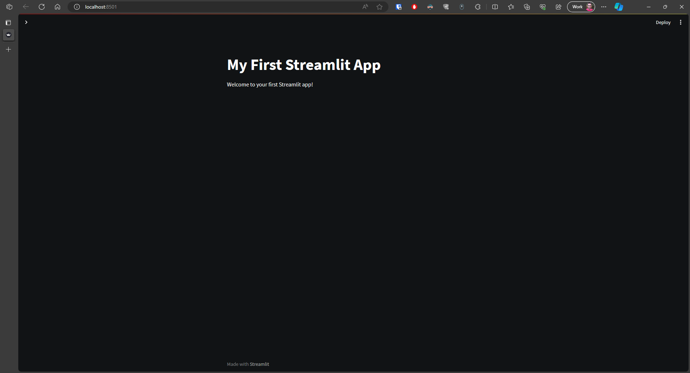

## Introduction to Streamlit

Streamlit is an open-source Python library that makes it incredibly easy to create web applications for data science and machine learning projects. It's designed for data professionals, engineers, and developers who want to quickly turn data scripts into shareable web apps.

## Why Streamlit?

- **Simplicity:** Streamlit is known for its simplicity. With just a few lines of Python code, you can create interactive web applications.

- **Rapid Development:** It allows for rapid development and prototyping, enabling you to go from data analysis to a functional web app in a matter of minutes.

- **Integration:** Streamlit integrates seamlessly with popular data science libraries like Pandas, Matplotlib, and Plotly, making it an ideal choice for data visualization.

- **Customization:** While Streamlit is easy for beginners, it also provides options for customization and advanced features for more experienced developers.

In this section, we will introduce you to the world of Streamlit and show you how to get started with creating your own data-driven web applications.


## Installation and Setup

Before you can start building web applications with Streamlit, it's a good practice to create a virtual environment for your project. This isolates your project's dependencies from the system-wide Python installation. Follow these steps to create a virtual environment and install Streamlit:

### Step 1: Prerequisites

Before proceeding, ensure you have the following prerequisites in place:

- Python: Streamlit is a Python library, so you'll need Python installed. If you haven't already, you can [download Python here](https://www.python.org/downloads/). Recommended version 3.x+

### Step 2: Create a Virtual Environment

1. Open your terminal or command prompt.
2. Navigate to the directory where you want to create your project.
3. Create a virtual environment by running the following command:

```bash
python -m venv myenv
```

### Step 3: Activate the Virtual Environment
```bash
source myenv/bin/activate
```

### Step 4: Install Streamlit
Now that you have activated your virtual environment, you can install Streamlit. Run the following command:

```bash
pip install streamlit
```

This will download and install Streamlit and its dependencies within your virtual environment.

### Step 6: Create Your First Streamlit App

Now that Streamlit is installed in your virtual environment, you can create your first Streamlit app. Create a Python script (e.g., my_app.py) and start building your app using Streamlit's simple API.

Here's an example of a basic Streamlit app:

```python
# main.py

import streamlit as st

st.title('My First Streamlit App')
st.write('Welcome to your first Streamlit app!')
```

Save the script, open your terminal, navigate to the directory where the script is located, and run:

```python
streamlit run my_app.py
```

This will launch your Streamlit app in a new browser window.



You're now ready to start building and deploying Streamlit applications for your data science and machine learning projects.

Note: Streamlit is continuously evolving, so make sure to check the official documentation for the most up-to-date installation.


### Step 7: Export Requirements to requirements.txt

Before you commit your code to github, it's a good practice to export the project's dependencies to a requirements.txt file. This makes it easier to recreate the same environment on another machine or share it with others. To do this, run the following command:

```bash
pip freeze > requirements.txt
```

This command will capture the list of installed packages in your virtual environment and save them to a file named requirements.txt in your project directory.

### Step 8: Best Practices and Gitignore

???+ warning
    Never commit sensitive data or your Python virtual environment to your version control system.

When working on your Streamlit projects, it's important to follow best practices and take precautions to secure sensitive data. Here are some important considerations:

- **Use a `.gitignore` file:** To avoid accidentally committing sensitive information to your version control system, such as your Python virtual environment or files containing sensitive data, make sure to create and maintain a `.gitignore` file in your project directory. This file lists the files and directories that should be excluded from version control.

    ```plaintext
    # .gitignore
    myenv/
    .env
    ```

    In the example above, we've added `myenv/` to exclude the virtual environment and `.env` to exclude any files containing sensitive data.

- **Never commit your Python virtual environment:** Your virtual environment should not be committed to your version control system. It's specific to your local environment and can cause conflicts and unnecessary bloat in your repository.

- **Secure sensitive data:** If your Streamlit app uses sensitive data (such as API keys or passwords), ensure that this information is stored securely, ideally in environment variables. Do not include this information directly in your code.

By following these best practices, you can keep your Streamlit projects organized, secure, and free from unnecessary bloat in your version control history.

## Resources and Further Reading

Here are some valuable resources and references to help you dive deeper into Streamlit and enhance your skills:

### Official Streamlit Documentation

- [Streamlit Official Documentation](https://docs.streamlit.io/library/get-started): The official documentation is your go-to source for comprehensive information on Streamlit's features, components, and usage. It includes tutorials, guides, and examples to help you get the most out of Streamlit.


- [Streamlit Component API Documentation](https://docs.streamlit.io/library/api-reference): Explore the Streamlit Component API documentation to learn how to create and use custom components in your Streamlit apps.

### Community and Support

- [Streamlit Community](https://discuss.streamlit.io/): Join the Streamlit community forum to connect with other users, ask questions, share your projects, and seek assistance. It's a great place to learn from experienced Streamlit developers.

- [Stack Overflow](https://stackoverflow.com/questions/tagged/streamlit): Explore Streamlit-related questions and answers on Stack Overflow, a valuable resource for troubleshooting and problem-solving.

### Streamlit Gallery

- [Streamlit Gallery](https://streamlit.io/gallery): Explore the Streamlit Gallery to find a collection of example apps, demos, and templates. It's an excellent source of inspiration for your own projects.

### Streamlit Roadmap App

- [Streamlit Roadmap App](https://roadmap.streamlit.app/): Access the Streamlit Roadmap App to stay updated on the latest features, enhancements, and future plans for Streamlit's development.

### Blogs and Tutorials

- [Towards Data Science Streamlit Articles](https://towardsdatascience.com/tagged/streamlit): Read blog articles and tutorials related to Streamlit on Towards Data Science. You'll find in-depth guides, tips, and project showcases.

- [Medium Streamlit Stories](https://medium.com/tag/streamlit): Discover Streamlit-related stories and articles on Medium. Many authors share their experiences and insights about using Streamlit.

### GitHub Repositories

- [Streamlit GitHub Repository](https://github.com/streamlit/streamlit): Explore the source code for Streamlit on its GitHub repository. You can also contribute to the development of Streamlit if you're interested.

These resources are designed to help you become proficient in Streamlit and explore its capabilities in greater detail. Whether you're a beginner or an experienced developer, there's something for everyone to learn and build with Streamlit.
