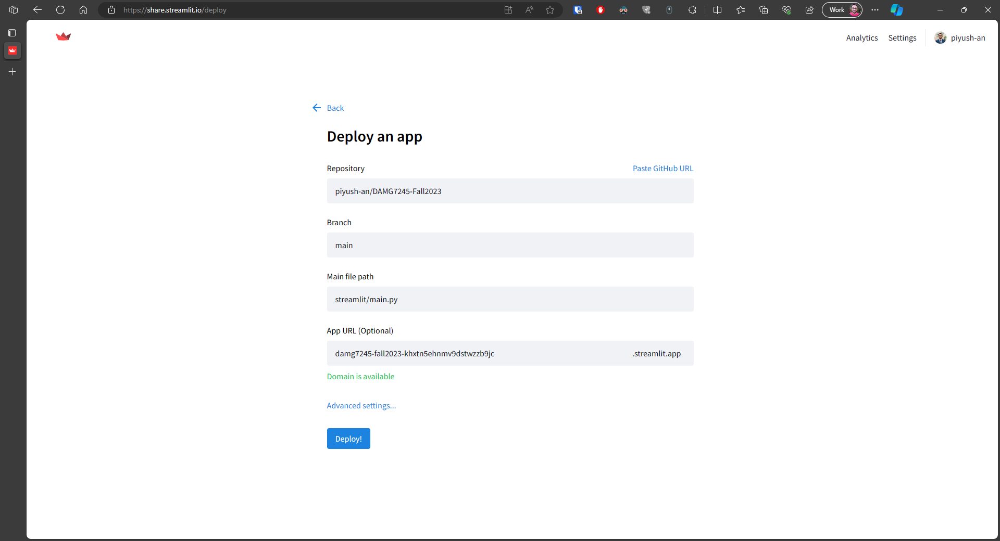
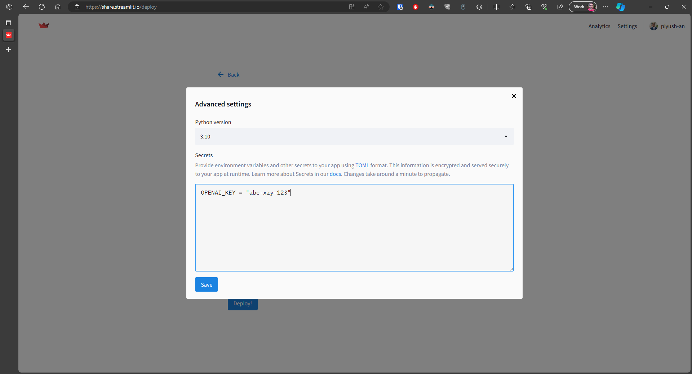

# Deploying a Streamlit Application

In this guide, we'll walk you through the process of deploying a Streamlit application from a GitHub repository to Streamlit Cloud. Streamlit Cloud is a platform that makes it easy to share your data apps with the world. Follow these steps to get your Streamlit app up and running in the cloud.

## Prerequisites

Before you begin, make sure you have the following prerequisites in place:

1. A Streamlit application hosted on a GitHub repository.
2. A Streamlit Cloud account. You can sign up for one at [Streamlit Cloud](https://streamlit.io/cloud).

## Instruction

### Step 1: Create a Streamlit Cloud Account

If you haven't already, sign up for a Streamlit Cloud account using your preferred authentication method.

### Step 2: Login to Streamlit Cloud

Log in to your Streamlit Cloud account to access the Streamlit Cloud dashboard.

### Step 3: Create a New App

1. In the Streamlit Cloud dashboard, click the "Create a New App" button.
2. Choose a name for your app.
3. Connect your GitHub repository by providing the GitHub repository URL.

### Step 4: Configure Deployment Settings

Streamlit Cloud provides you with various deployment settings, such as the app name, environment variables, and version control options. Configure these settings as per your project requirements.

### Step 5: Deploy the App

Click the "Deploy" button to start the deployment process. Streamlit Cloud will clone your GitHub repository, install the necessary dependencies, and launch your Streamlit app.

### Step 6: Access Your Deployed App

Once the deployment is complete, you'll receive a unique URL for your Streamlit app. You can share this URL with others to access and interact with your application.

### Step 7: Monitor and Update

Streamlit Cloud allows you to monitor your deployed app's usage and performance. You can also easily update your app by pushing changes to your GitHub repository. Streamlit Cloud will automatically rebuild and redeploy your app with the latest changes.

Congratulations! Your Streamlit application is now live on Streamlit Cloud and accessible to a global audience.

For more advanced configuration options and detailed instructions, refer to the official [Streamlit Cloud documentation](https://docs.streamlit.io/streamlit-community-cloud/get-started).

Enjoy sharing your Streamlit apps with the world!
